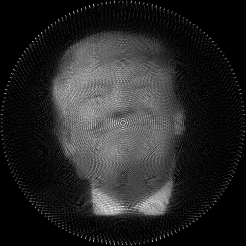
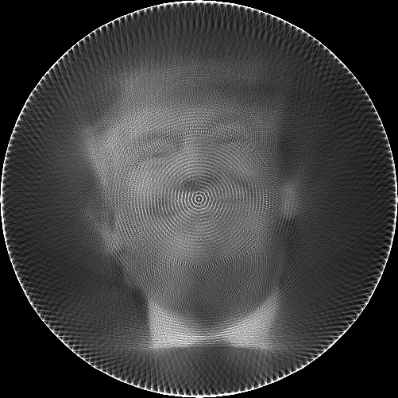
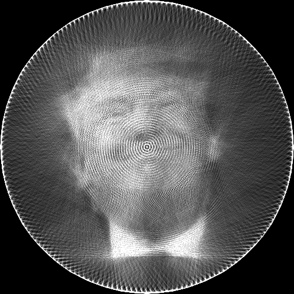
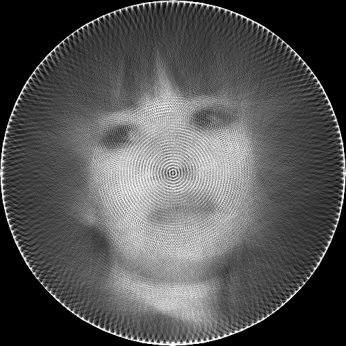
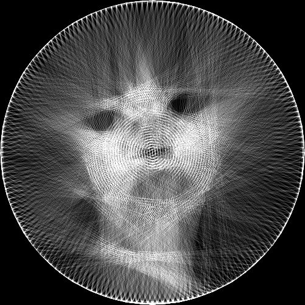

# String art

Tool calculating how to recreate an input image as [string art](https://en.wikipedia.org/wiki/String_art),
that is, by arranging a single line of thread wound around a circle of nails.

The video that originally inspired this is not on the web anymore, but this more recent one is similar:

[](http://www.youtube.com/watch?v=XJRVqzoQUG0 "String art")


## Usage:

```python strings.py input-image.png output-prefix```

The input image should be square-shaped.

The output is in ```output-prefix.png```. There are two extra files showing intermediary steps of the computation:
```output-prefix-allow-negative.png``` shows the string art when both black and white strings are allowed.
```output-prefix-unquantized.png``` shows the string art when infinitely thin and long threads are allowed (but only white).

## Example output:

Image with allow-negative:



Image unquantized:



Final image, created from ~12000 arcs. Assuming a circle of diameter 1 meter, this is ~10 kilometers of thread:



Don't try to be too cheap with the strings:




